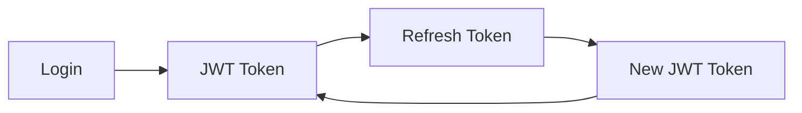

# API Reference Overview

The EMPACTS platform provides a comprehensive REST API for integrating with our startup-mentor connection platform.

## Base URL

```
Production: https://api.empacts.org/v1
Staging: https://api-staging.empacts.org/v1
```

## Authentication

All API requests require authentication using JWT tokens. Include the token in the Authorization header:

```http
Authorization: Bearer <your-jwt-token>
```

## Response Format

All API responses follow a consistent JSON format:

```json
{
  "success": true,
  "data": {
    // Response data here
  },
  "message": "Operation completed successfully",
  "timestamp": "2024-01-15T10:30:00Z"
}
```

## Error Handling

Error responses include detailed information:

```json
{
  "success": false,
  "error": {
    "code": "VALIDATION_ERROR",
    "message": "Invalid input parameters",
    "details": {
      "field": "email",
      "issue": "Invalid email format"
    }
  },
  "timestamp": "2024-01-15T10:30:00Z"
}
```

## Rate Limiting

- **Standard users**: 100 requests per minute
- **Premium users**: 500 requests per minute
- **Admin users**: 1000 requests per minute

Rate limit headers are included in responses:

```http
X-RateLimit-Limit: 100
X-RateLimit-Remaining: 95
X-RateLimit-Reset: 1642234567
```

## API Endpoints

### Authentication



- `POST /auth/login` - User authentication
- `POST /auth/register` - User registration
- `POST /auth/refresh` - Refresh JWT token
- `POST /auth/logout` - User logout

### Users

- `GET /users/profile` - Get user profile
- `PUT /users/profile` - Update user profile
- `GET /users/{id}` - Get user by ID
- `GET /users/search` - Search users

### Startups

- `GET /startups` - List startups
- `POST /startups` - Create startup profile
- `GET /startups/{id}` - Get startup details
- `PUT /startups/{id}` - Update startup profile
- `DELETE /startups/{id}` - Delete startup profile

### Mentors

- `GET /mentors` - List mentors
- `POST /mentors` - Create mentor profile
- `GET /mentors/{id}` - Get mentor details
- `PUT /mentors/{id}` - Update mentor profile
- `GET /mentors/{id}/availability` - Get mentor availability

### Matching

- `POST /matching/request` - Request mentor matching
- `GET /matching/requests` - List matching requests
- `PUT /matching/requests/{id}` - Update matching request
- `DELETE /matching/requests/{id}` - Cancel matching request

### Communication

- `GET /messages` - List messages
- `POST /messages` - Send message
- `GET /messages/{id}` - Get message details
- `PUT /messages/{id}/read` - Mark message as read

## SDKs and Libraries

### JavaScript/TypeScript

```bash
npm install @empacts/api-client
```

```javascript
import { EmpactsAPI } from '@empacts/api-client';

const api = new EmpactsAPI({
  baseURL: 'https://api.empacts.org/v1',
  token: 'your-jwt-token'
});

// Get user profile
const profile = await api.users.getProfile();

// Create startup profile
const startup = await api.startups.create({
  name: 'My Startup',
  description: 'Innovative SDG solution',
  industry: 'clean-energy'
});
```

### Python

```bash
pip install empacts-api
```

```python
from empacts_api import EmpactsAPI

api = EmpactsAPI(
    base_url='https://api.empacts.org/v1',
    token='your-jwt-token'
)

# Get user profile
profile = api.users.get_profile()

# Create startup profile
startup = api.startups.create({
    'name': 'My Startup',
    'description': 'Innovative SDG solution',
    'industry': 'clean-energy'
})
```

## Webhooks

Configure webhooks to receive real-time updates:

```json
{
  "url": "https://your-app.com/webhooks/empacts",
  "events": ["user.created", "matching.completed", "message.sent"],
  "secret": "your-webhook-secret"
}
```

## Testing

Use our sandbox environment for testing:

```bash
# Set environment
export EMPACTS_API_URL=https://api-sandbox.empacts.org/v1
export EMPACTS_API_TOKEN=your-sandbox-token

# Test API
curl -H "Authorization: Bearer $EMPACTS_API_TOKEN" \
     https://api-sandbox.empacts.org/v1/users/profile
```

## Support

- **Documentation**: This site
- **API Status**: https://status.empacts.org
- **Support Email**: api-support@empacts.org
- **Developer Discord**: https://discord.gg/empacts-dev

---

**Related Documents:**
- [Authentication Guide](./authentication)
- [User Management API](./users)
- [Matching API](./matching)
- [Webhook Integration](./webhooks)
