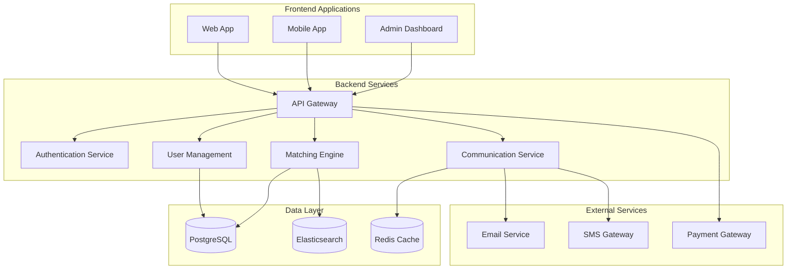
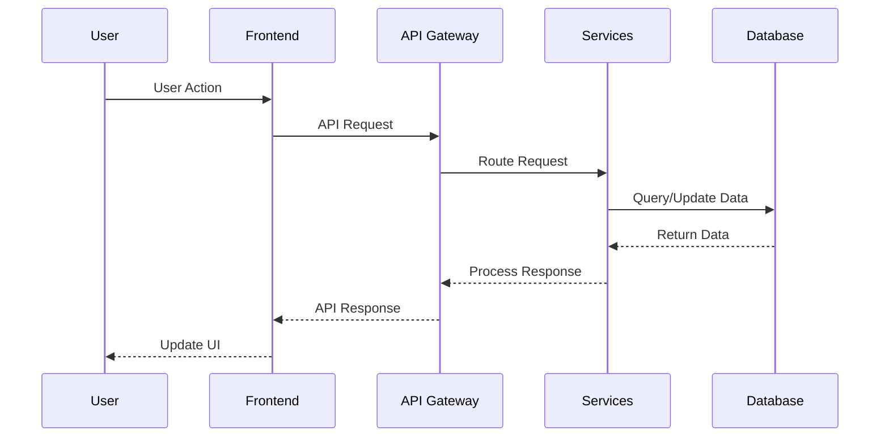

# System Architecture Overview

This document provides a high-level overview of the EMPACTS platform architecture, designed to connect startups with mentors effectively.

## Platform Vision

Our platform serves as a bridge between SDG-focused startups in Vietnam and experienced mentors, facilitating knowledge transfer and growth opportunities.

## High-Level Architecture

## Core Components

### 1. Frontend Applications

- **Web Application**: Primary interface for startups and mentors
- **Mobile Application**: Mobile-optimized experience
- **Admin Dashboard**: Platform management and analytics

### 2. Backend Services

- **API Gateway**: Central entry point for all client requests
- **Authentication Service**: User authentication and authorization
- **User Management**: Profile management and user data
- **Matching Engine**: Algorithm for connecting startups with mentors
- **Communication Service**: Messaging and notification system

### 3. Data Layer

- **PostgreSQL**: Primary relational database
- **Redis**: Caching and session management
- **Elasticsearch**: Search functionality and analytics

### 4. External Services

- **Email Service**: Transactional emails
- **SMS Gateway**: Text message notifications
- **Payment Gateway**: Subscription and payment processing

## Data Flow

## Technology Stack

### Frontend
- **React.js** - Web application framework
- **React Native** - Mobile application
- **TypeScript** - Type safety and better development experience

### Backend
- **Node.js** - Runtime environment
- **Express.js** - Web framework
- **PostgreSQL** - Primary database
- **Redis** - Caching layer

### DevOps
- **Docker** - Containerization
- **Kubernetes** - Orchestration
- **AWS** - Cloud infrastructure

## Security Considerations

- JWT-based authentication
- Role-based access control (RBAC)
- Data encryption at rest and in transit
- Regular security audits
- GDPR compliance for user data

## Scalability Strategy

- Horizontal scaling with load balancers
- Database read replicas
- CDN for static assets
- Microservices architecture for independent scaling
- Caching strategies for improved performance

## Monitoring and Analytics

- Application performance monitoring (APM)
- Error tracking and alerting
- User behavior analytics
- Business metrics dashboard
- Real-time system health monitoring

---

**Related Documents:**
- [API Reference](../api/overview)
- [Database Schema](../architecture/database)
- [Deployment Guide](../deployment/overview)
- [Security Guidelines](../security/overview)
