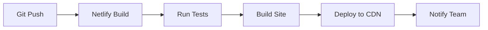

# Netlify Deployment Guide

This guide covers deploying the EMPACTS technical documentation to Netlify with CMS integration.

## Overview

Netlify provides hosting, continuous deployment, and a headless CMS for our documentation site. This setup enables:

- **Automatic deployments** from Git
- **Content management** via Netlify CMS
- **Form handling** for contact forms
- **CDN** for fast global delivery
- **SSL certificates** automatically managed

## Setup Process

### 1. Connect Repository

1. Go to [Netlify](https://netlify.com) and sign up/login
2. Click "New site from Git"
3. Connect your GitHub account
4. Select the `EMPACTS-Technical-Docs` repository
5. Configure build settings:
   - **Build command**: `npm run build`
   - **Publish directory**: `build`
   - **Base directory**: (leave empty)

### 2. Environment Variables

Set these environment variables in Netlify:

```bash
# Build settings
NODE_VERSION=18
NPM_VERSION=9

# Site configuration
SITE_URL=https://your-site-name.netlify.app
GATSBY_SITE_URL=https://your-site-name.netlify.app

# CMS settings (if using Netlify CMS)
NETLIFY_CMS_LOCAL_BACKEND=true
```

### 3. Domain Configuration

1. Go to **Site settings** > **Domain management**
2. Add your custom domain (e.g., `docs.empacts.org`)
3. Configure DNS records as instructed
4. Enable HTTPS (automatic with Netlify)

## Netlify CMS Configuration

### Enable Identity

1. Go to **Site settings** > **Identity**
2. Click **Enable Identity**
3. Configure registration settings:
   - **Registration**: Invite only
   - **External providers**: GitHub (optional)

### Configure CMS

The CMS is already configured in `static/admin/config.yml`. Key features:

- **Git Gateway**: Allows content editing without Git access
- **Collections**: Documentation, blog posts, pages
- **Custom widgets**: Mermaid diagrams, code blocks
- **Media management**: Image uploads to `static/img`

### User Management

1. Go to **Site settings** > **Identity** > **Users**
2. Invite team members by email
3. Assign roles:
   - **Editor**: Can edit content
   - **Admin**: Can manage users and settings

## Deployment Workflow

### Automatic Deployments



### Manual Deployments

```bash
# Trigger manual deployment
netlify deploy --prod

# Deploy preview
netlify deploy --dir=build
```

### Branch Deployments

- **Main branch**: Production deployment
- **Feature branches**: Preview deployments
- **Pull requests**: Automatic preview URLs

## Content Management

### Adding New Documentation

1. Go to `/admin` on your site
2. Login with Netlify Identity
3. Select "Documentation" collection
4. Click "New Documentation"
5. Fill in the form:
   - **Title**: Document title
   - **Tags**: Relevant tags
   - **Body**: Markdown content with Mermaid diagrams
6. Click "Publish"

### Mermaid Diagrams

Use the custom Mermaid widget:

```yaml
# In the CMS editor
type: graph
direction: TB
code: |
  graph TB
      A[Start] --> B[Process]
      B --> C[End]
```

### Code Blocks

Use the custom code block widget:

```yaml
# In the CMS editor
language: typescript
title: Example API Call
code: |
  const api = new EmpactsAPI({
    baseURL: 'https://api.empacts.org/v1',
    token: 'your-jwt-token'
  });
```

## Forms and Functions

### Contact Form

Add this to any page:

```html
<form name="contact" netlify>
  <input type="text" name="name" placeholder="Your Name" required>
  <input type="email" name="email" placeholder="Your Email" required>
  <textarea name="message" placeholder="Your Message" required></textarea>
  <button type="submit">Send Message</button>
</form>
```

### Serverless Functions

Create functions in `netlify/functions/`:

```javascript
// netlify/functions/contact.js
exports.handler = async (event) => {
  if (event.httpMethod !== 'POST') {
    return { statusCode: 405, body: 'Method Not Allowed' };
  }

  try {
    const data = JSON.parse(event.body);
    
    // Process form data
    // Send email, save to database, etc.
    
    return {
      statusCode: 200,
      body: JSON.stringify({ message: 'Success' })
    };
  } catch (error) {
    return {
      statusCode: 500,
      body: JSON.stringify({ error: 'Internal Server Error' })
    };
  }
};
```

## Performance Optimization

### Build Optimization

```javascript
// docusaurus.config.js
module.exports = {
  // Enable build optimizations
  future: {
    v4: true,
  },
  
  // Optimize images
  plugins: [
    [
      '@docusaurus/plugin-content-docs',
      {
        // Enable image optimization
        remarkPlugins: [require('remark-gfm')],
      },
    ],
  ],
};
```

### CDN Configuration

Netlify automatically provides:

- **Global CDN**: Fast delivery worldwide
- **Image optimization**: Automatic resizing and compression
- **Asset optimization**: Minification and compression
- **Caching**: Intelligent caching strategies

## Monitoring and Analytics

### Netlify Analytics

1. Go to **Site settings** > **Analytics**
2. Enable **Netlify Analytics**
3. View metrics:
   - Page views
   - Unique visitors
   - Top pages
   - Referrers

### Custom Analytics

Add Google Analytics:

```html
<!-- In docusaurus.config.js -->
module.exports = {
  scripts: [
    {
      src: 'https://www.googletagmanager.com/gtag/js?id=GA_MEASUREMENT_ID',
      async: true,
    },
  ],
  headTags: [
    {
      tagName: 'script',
      innerHTML: `
        window.dataLayer = window.dataLayer || [];
        function gtag(){dataLayer.push(arguments);}
        gtag('js', new Date());
        gtag('config', 'GA_MEASUREMENT_ID');
      `,
    },
  ],
};
```

## Troubleshooting

### Common Issues

**Build Failures**
```bash
# Check build logs
netlify logs --site=your-site-id

# Test build locally
npm run build
```

**CMS Access Issues**
- Verify Identity is enabled
- Check user permissions
- Clear browser cache

**Domain Issues**
- Verify DNS records
- Check SSL certificate status
- Wait for DNS propagation

### Support Resources

- [Netlify Documentation](https://docs.netlify.com)
- [Netlify CMS Guide](https://www.netlifycms.org/docs)
- [Docusaurus Deployment](https://docusaurus.io/docs/deployment)

## Security Considerations

### Access Control

- **Identity**: Secure user authentication
- **CMS Access**: Role-based permissions
- **Form Spam**: Enable spam protection
- **HTTPS**: Automatic SSL certificates

### Content Security

- **Input Validation**: Sanitize user inputs
- **File Uploads**: Restrict file types and sizes
- **API Keys**: Use environment variables
- **Backups**: Regular content backups

---

**Related Documents:**
- [Deployment Overview](./overview)
- [Architecture Documentation](../architecture/overview)
- [Development Guidelines](../development/guidelines)
