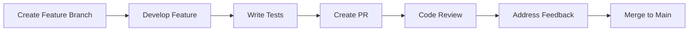

# Development Guidelines

This document outlines the development standards and best practices for the EMPACTS development team.

## Code Style and Standards

### General Principles

- **Readability First**: Code should be self-documenting and easy to understand
- **Consistency**: Follow established patterns and conventions
- **Maintainability**: Write code that's easy to modify and extend
- **Performance**: Consider performance implications of design decisions

### Language-Specific Guidelines

#### JavaScript/TypeScript

```typescript
// ✅ Good: Clear naming, proper typing
interface UserProfile {
  id: string;
  name: string;
  email: string;
  role: UserRole;
}

const createUser = async (userData: Partial<UserProfile>): Promise<UserProfile> => {
  // Implementation
};

// ❌ Bad: Unclear naming, no typing
const u = (d) => {
  // Implementation
};
```

**Naming Conventions:**
- Use `camelCase` for variables and functions
- Use `PascalCase` for classes and interfaces
- Use `UPPER_SNAKE_CASE` for constants
- Use descriptive names that explain purpose

**File Organization:**
```
src/
├── components/
│   ├── common/
│   ├── forms/
│   └── layout/
├── hooks/
├── services/
├── types/
└── utils/
```

#### Python

```python
# ✅ Good: Clear naming, type hints, docstrings
from typing import Optional, List

class UserService:
    """Service for managing user operations."""
    
    def get_user_by_id(self, user_id: str) -> Optional[User]:
        """
        Retrieve a user by their ID.
        
        Args:
            user_id: The unique identifier of the user
            
        Returns:
            User object if found, None otherwise
        """
        # Implementation
        pass

# ❌ Bad: No type hints, unclear naming
def get_u(id):
    # Implementation
    pass
```

## Git Workflow

### Branch Naming

```bash
# Feature branches
feature/user-authentication
feature/matching-algorithm

# Bug fixes
fix/login-validation-error
fix/api-rate-limiting

# Hotfixes
hotfix/security-patch
hotfix/critical-bug
```

### Commit Messages

Follow the [Conventional Commits](https://www.conventionalcommits.org/) specification:

```bash
# Format: <type>[optional scope]: <description>

feat(auth): add JWT token refresh functionality
fix(api): resolve rate limiting issue for premium users
docs(readme): update installation instructions
test(matching): add unit tests for matching algorithm
refactor(ui): simplify component structure
```

### Pull Request Process



1. **Create Feature Branch**: Branch from `main`
2. **Develop Feature**: Implement with tests
3. **Create PR**: Include description and screenshots
4. **Code Review**: At least one approval required
5. **Address Feedback**: Update based on review comments
6. **Merge**: Squash and merge to `main`

## Testing Standards

### Test Structure

```typescript
// Unit test example
describe('UserService', () => {
  describe('createUser', () => {
    it('should create a new user with valid data', async () => {
      // Arrange
      const userData = {
        name: 'John Doe',
        email: 'john@example.com'
      };
      
      // Act
      const result = await userService.createUser(userData);
      
      // Assert
      expect(result).toHaveProperty('id');
      expect(result.name).toBe(userData.name);
    });
    
    it('should throw error for invalid email', async () => {
      // Test error cases
    });
  });
});
```

### Testing Requirements

- **Unit Tests**: 80% code coverage minimum
- **Integration Tests**: For API endpoints and database operations
- **E2E Tests**: For critical user flows
- **Performance Tests**: For high-traffic endpoints

## Security Guidelines

### Authentication & Authorization

```typescript
// ✅ Good: Proper JWT validation
const validateToken = (token: string): boolean => {
  try {
    const decoded = jwt.verify(token, process.env.JWT_SECRET);
    return decoded.exp > Date.now() / 1000;
  } catch (error) {
    return false;
  }
};

// ❌ Bad: No validation
const validateToken = (token: string): boolean => {
  return token.length > 0;
};
```

### Data Validation

```typescript
// ✅ Good: Input validation
import { z } from 'zod';

const UserSchema = z.object({
  email: z.string().email(),
  password: z.string().min(8),
  name: z.string().min(1)
});

const validateUserInput = (data: unknown) => {
  return UserSchema.parse(data);
};
```

### Security Checklist

- [ ] Input validation and sanitization
- [ ] SQL injection prevention
- [ ] XSS protection
- [ ] CSRF protection
- [ ] Rate limiting
- [ ] Secure headers
- [ ] HTTPS enforcement
- [ ] Regular dependency updates

## Performance Guidelines

### Database Optimization

```sql
-- ✅ Good: Indexed queries
CREATE INDEX idx_users_email ON users(email);
SELECT * FROM users WHERE email = 'user@example.com';

-- ❌ Bad: No indexes
SELECT * FROM users WHERE email = 'user@example.com';
```

### Caching Strategy

```typescript
// ✅ Good: Redis caching
const getUserProfile = async (userId: string) => {
  const cacheKey = `user:${userId}`;
  
  // Try cache first
  let user = await redis.get(cacheKey);
  if (user) {
    return JSON.parse(user);
  }
  
  // Fetch from database
  user = await db.users.findById(userId);
  
  // Cache for 1 hour
  await redis.setex(cacheKey, 3600, JSON.stringify(user));
  
  return user;
};
```

## Documentation Standards

### Code Documentation

```typescript
/**
 * Creates a new user account with the provided information.
 * 
 * @param userData - The user registration data
 * @param options - Additional options for user creation
 * @returns Promise resolving to the created user
 * 
 * @example
 * ```typescript
 * const user = await createUser({
 *   name: 'John Doe',
 *   email: 'john@example.com',
 *   password: 'securepassword'
 * });
 * ```
 * 
 * @throws {ValidationError} When user data is invalid
 * @throws {DuplicateEmailError} When email already exists
 */
async function createUser(
  userData: CreateUserData,
  options?: CreateUserOptions
): Promise<User> {
  // Implementation
}
```

### API Documentation

- Use OpenAPI/Swagger for API documentation
- Include request/response examples
- Document error codes and messages
- Provide SDK examples

## Code Review Checklist

### General
- [ ] Code follows style guidelines
- [ ] Proper error handling
- [ ] No hardcoded values
- [ ] Meaningful variable names
- [ ] No commented-out code

### Security
- [ ] Input validation
- [ ] Authentication checks
- [ ] Authorization checks
- [ ] No sensitive data in logs
- [ ] Secure configuration

### Performance
- [ ] Efficient algorithms
- [ ] Database query optimization
- [ ] Proper caching
- [ ] No memory leaks
- [ ] Resource cleanup

### Testing
- [ ] Unit tests included
- [ ] Integration tests if needed
- [ ] Test coverage adequate
- [ ] Edge cases covered
- [ ] Error scenarios tested

## Tools and Linting

### ESLint Configuration

```json
{
  "extends": [
    "@typescript-eslint/recommended",
    "prettier"
  ],
  "rules": {
    "@typescript-eslint/no-unused-vars": "error",
    "@typescript-eslint/explicit-function-return-type": "warn",
    "prefer-const": "error"
  }
}
```

### Pre-commit Hooks

```json
{
  "husky": {
    "hooks": {
      "pre-commit": "lint-staged",
      "commit-msg": "commitlint -E HUSKY_GIT_PARAMS"
    }
  },
  "lint-staged": {
    "*.{js,ts}": ["eslint --fix", "prettier --write"],
    "*.{md,json}": ["prettier --write"]
  }
}
```

---

**Related Documents:**
- [API Documentation](../api/overview)
- [Testing Strategy](./testing)
- [Security Guidelines](./security)
- [Deployment Process](./deployment)
